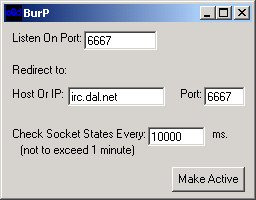



## Connection bouncer / redirector

### Description

Redirects connections. Functions like a bouncer or proxy. I wrote it for a friend that went to school and they would only allow outbound connections threw port 80 (standard http port) So I set this up for him on my machine listening on port 80 and redirecting him to and irc server on port 6667. Nifty eh?
 
### More Info
 

             |
---                |---
**Submitted On**   |2000-06-17 18:17:44
**By**             |[Dave Stringer](https://github.com/Planet-Source-Code/PSCIndex/blob/master/ByAuthor/dave-stringer.md)
**Level**          |Intermediate
**User Rating**    |4.8 (29 globes from 6 users)
**Compatibility**  |VB 6\.0
**Category**       |[Miscellaneous](https://github.com/Planet-Source-Code/PSCIndex/blob/master/ByCategory/miscellaneous__1-1.md)
**World**          |[Visual Basic](https://github.com/Planet-Source-Code/PSCIndex/blob/master/ByWorld/visual-basic.md)
**Archive File**   |[Connection1314879152002\.zip](https://github.com/Planet-Source-Code/dave-stringer-connection-bouncer-redirector__1-39020/archive/master.zip)

